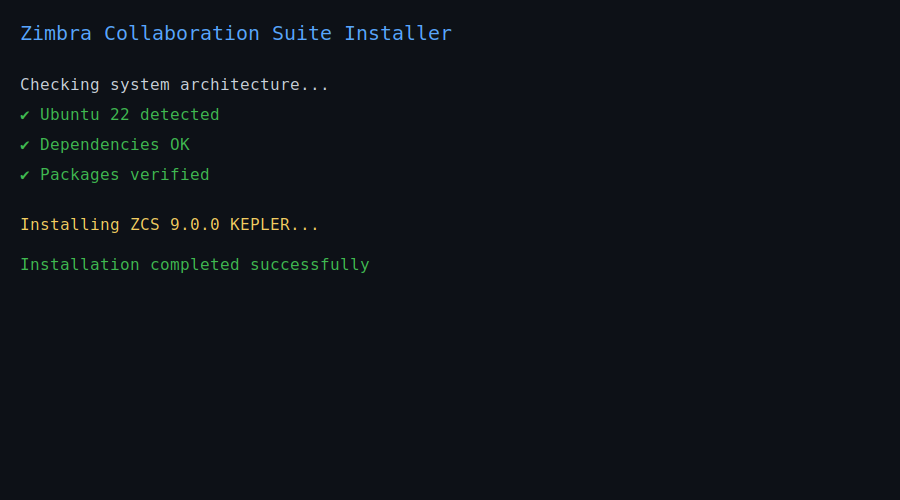
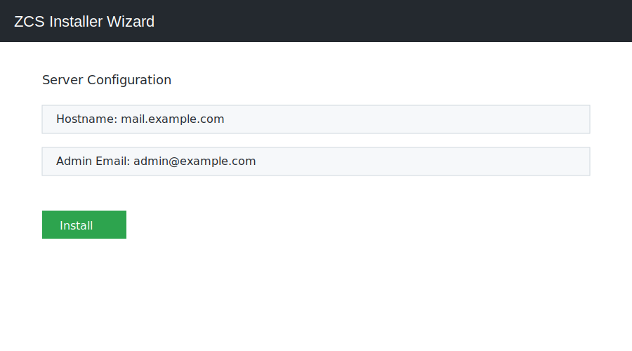
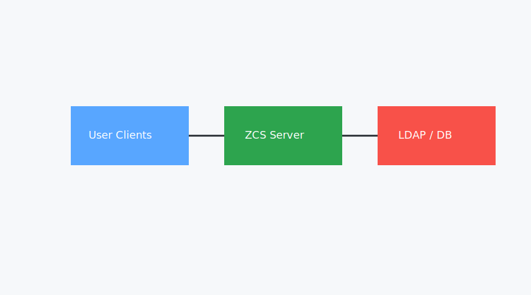

# Zimbra ZCS 9 KEPLER Ubuntu 22 Build


Official Zimbra Collaboration Suite 9 (KEPLER) Ubuntu 22 custom build bundle.

---

## 📦 Download

## 📥 Official Zimbra OSE Downloads

In addition to this community build, you can also use the official Zimbra Open Source Edition installers.

**Zimbra 9.0.0 Official Downloads**

- **Ubuntu 22.04 (U22 / x64)**  
  https://github.com/martbrooks/zimbra_direct_downloads/raw/main/9.0.0/UBUNTU22_64/

- **Debian 11 (DEB / x64)**  
  https://github.com/martbrooks/zimbra_direct_downloads/raw/main/9.0.0/DEBIAN11_64/

- **EL8 (RHEL/CentOS/Alma/Rocky 8)**  
  https://github.com/martbrooks/zimbra_direct_downloads/raw/main/9.0.0/RHEL8_64/

- **EL7 (RHEL/CentOS/Alma/Rocky 7)**  
  https://github.com/martbrooks/zimbra_direct_downloads/raw/main/9.0.0/RHEL7_64/

> Browse the above directories to find `.tgz`, `.deb`, `.zip` bundles listed by platform.


👉 **Latest Release:**  
https://github.com/alierenerdal/zcs-kepler-u22-build/releases/latest

---

## 🧱 System Architecture


ZCS multi-layer architecture:

- LDAP
- Mailbox
- Proxy
- MTA
- Logger
- SNMP
- Web client

Supports:

- Single server
- Multi-server topology
- Horizontal scaling

---

## Install Screenshots




## System Architecture




## 🖥 Install Guide

```bash
tar -xzf zcs-9.0.0_GA_1013.UBUNTU22_64.20260207114844.tgz
cd zcs-9.0.0*
./install.sh
```

Follow interactive installer.


---

## 🔁 Upgrade Guide

See:

👉 docs/upgrade-guide.md

Supports upgrade from:

- ZCS 8.8.x
- ZCS 9 GA
- ZCS KEPLER builds

---

## 🧩 Multi-Server Topology

See:

👉 docs/architecture.md

Includes:

- LDAP master/replica
- Proxy tier
- Mailbox cluster
- MTA pool

---

## 🐳 Docker Install (Experimental)

```bash
cd docker
docker compose up -d
```

Template only. Production requires tuning.

---

## 🛠 Troubleshooting

Common issues covered:

- LDAP sync errors
- Postfix queue stuck
- Proxy TLS mismatch
- Java memory tuning
- Mailbox corruption recovery

👉 docs/troubleshooting.md

---

## ❓ FAQ

👉 docs/faq.md

Includes:

- Supported OS?
- RAM requirements?
- Backup strategy?
- Migration paths?
- License questions?

---

## 📊 Analytics

GitHub traffic analytics enabled.

Optional:

Add Plausible / GA badge here.

---

## 🔧 CI Pipeline

GitHub Actions pipeline:

- Build verification
- Release packaging
- GitHub Pages deployment
- Artifact validation

---

## 📄 Release Notes

Template:

👉 RELEASE_TEMPLATE.md

---

## 📜 License

Zimbra FOSS components.

See upstream licensing.

---

## ❤️ Maintainer

Ali Eren Erdal  
https://www.seonedir.co
